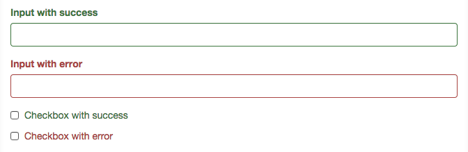
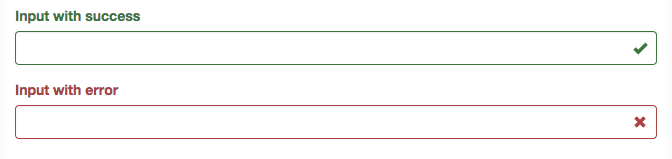

# ngFormGroup

`ngFormGroup` applies [Bootstrap validation classes](http://getbootstrap.com/css/#forms-control-validation) based on `ngModel`'s validity.

## Installation

In your Angular project, run `bower install --save ng-form-group` to save the
module. Then, in your HTML, add:

``` html
<script src="/path/to/bower_components/ng-form-group/index.min.js"></script>
```

And lastly, in your Angular module, include `ng-form-group` as a dependency:

``` javascript
angular.module('my-app', ['ng-form-group')
```

## Usage

Just mark up your form as [recommended by Bootstrap](http://getbootstrap.com/css/#forms-example)
and any fields with the class `form-group` will be automatically validated!

``` html
<form role="form">
  <div class="form-group">
    <label for="myEmail">Email address</label>
    <input type="email" ng-model="myEmailModel" class="form-control" id="myEmail">
  </div>
</form>
```

Now, when your model is invalided, by someone entering an invalid email
address, the `has-error` class will be added to your form-group.



If you want to disable feedback for a specific form, add the `form-group-without-feedback`
class to the form-group:

``` html
<form role="form">
  <div class="form-group form-group-without-feedback">
    <label for="search">Search for things:</label>
    <input type="search" ng-model="searchQuery" class="form-control" id="search">
  </div>
</form>
```


## Bonus round: Feedback icons!

Just add the [`.has-feedback`](http://getbootstrap.com/css/#forms-control-validation)
class to your form group, and we'll automatically add bootstrap style Feedback
icons to your form fields.




## Contributing

To get your dev environment up and running, run `npm install` and `bower install`
to get the components we need.

Tests are run with `npm run test` and you can build the minified source with
`npm run build`.

Releases are built using `npm run release:[type]`. So, to generate a new patch
release, run `npm run release:patch`. This script will:

* Generate minified, concatenated JS files,
* Increment the version in `package.json` and `bower.json`
* Tag a new release
